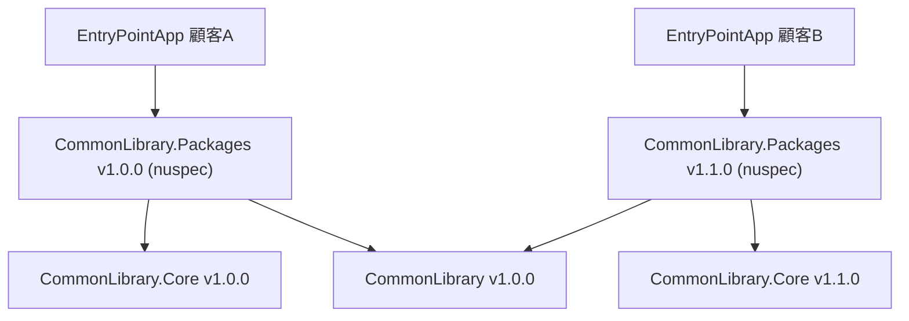

## パッケージ一覧

- CommonLibrary v1.0.0
- CommonLibrary.Core v1.0.0
- CommonLibrary.Core v1.1.0
- CommonLibrary.Packages v1.0.0
- CommonLibrary.Packages v1.1.0

## パッケージの依存関係

```mermaid
graph TD
    Appv1["EntryPointApp 顧客A"]
    Appv2["EntryPointApp 顧客B"]
    CPv1.0.0["CommonLibrary.Packages v1.0.0 (nuspec)"]
    CPv1.1.0["CommonLibrary.Packages v1.1.0 (nuspec)"]
    
    CLCorev1.0.0["CommonLibrary.Core v1.0.0"]
    CLCorev1.1.0["CommonLibrary.Core v1.1.0"]

    CLv1.0.0["CommonLibrary v1.0.0"]

    CPv1.0.0 --> CLCorev1.0.0
    CPv1.0.0 --> CLv1.0.0
    CPv1.1.0 --> CLCorev1.1.0
    CPv1.1.0 --> CLv1.0.0

    Appv1 --> CPv1.0.0
    Appv2 --> CPv1.1.0
```
