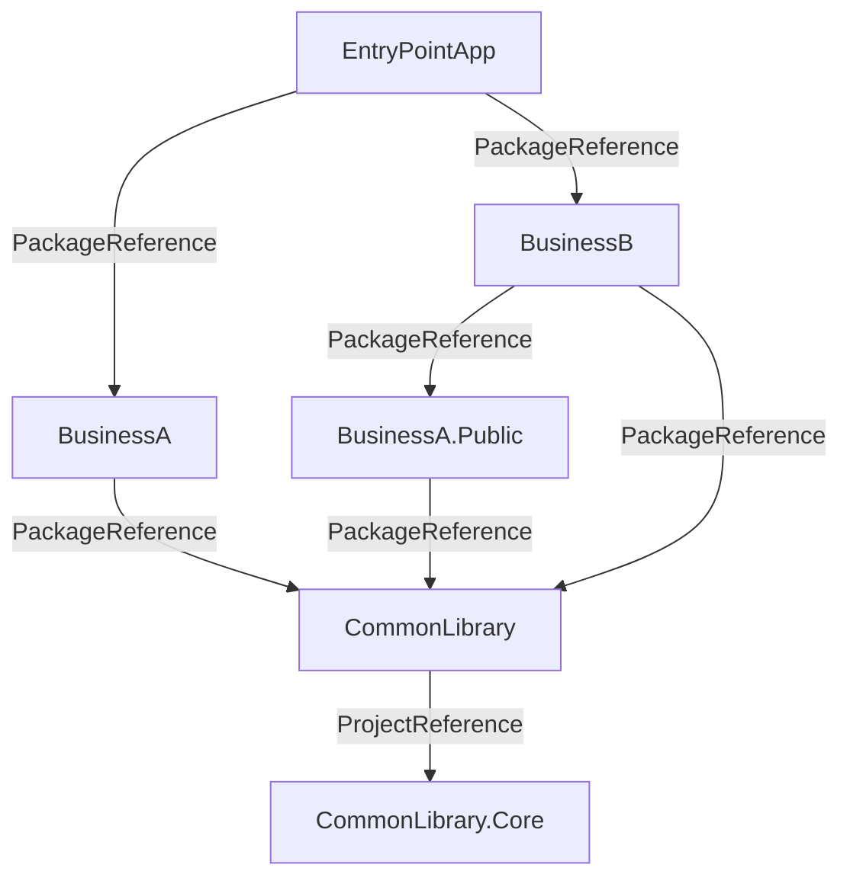

# Central Package Management 動作確認

## プロジェクトの依存関係

以下のような依存関係のプロジェクト



基本的にプロジェクト間の依存関係は `ProjectReference` ではなく `PackageReference` で管理する。同じ `Business` 内や `Common` 内は `ProjectReference` で管理する。

## パッケージ化

`Pack-Common.ps1`(CommonLibrary + CommonLibrary.Core) `Pack-BusinessA.ps1`(BusinessA), `Pack-BusinessA.Public.ps1`(BusinessA.Public), `Pack-BusinessB.ps1`(BusinessB) でそれぞれのプロジェクトをパッケージ化する。

## パッケージソース

`nuget.config` でローカルフォルダー(`./local`)をパッケージソースとして追加を行う。上記の `Pack-*.ps1` でパッケージ化したパッケージはこのフォルダーに保存される。

```xml:nuget.config
<?xml version="1.0" encoding="utf-8"?>
<configuration>
  <packageSources>
    <!--To inherit the global NuGet package sources remove the <clear/> line below -->
    <clear />
    <add key="nuget" value="https://api.nuget.org/v3/index.json" />
    <!-- 本番では Azure Artifacts や GitHub Packages を指定 -->
    <add key="local" value="./local" />
  </packageSources>
</configuration>
```

## `Directory.Build.props` と `Directory.Packages.props`

`BusinessA`, `BusinessB`, `Common` フォルダーにそれぞれ `Directory.Build.props` と `Directory.Packages.props` を配置する。
`Directory.Build.props` は、細かな差異はあるが概ね以下のような内容となる。

```xml:Directory.Build.props
<Project>
  <PropertyGroup>
    <TargetFramework>net8.0</TargetFramework>
    <ManagePackageVersionsCentrally>true</ManagePackageVersionsCentrally>
    <CentralPackageTransitivePinningEnabled>true</CentralPackageTransitivePinningEnabled>
    <UseArtifactsOutput>true</UseArtifactsOutput>
  </PropertyGroup>
  <ItemGroup>
    <PackageReference Include="CommonLibrary" />
  </ItemGroup>
</Project>
```

Central Package Management の有効化とフォルダー内のプロジェクトで共通的に参照するパッケージを指定する。
ただ、`PackageReference` は個別プロジェクトで指定しても良いと思われる。

`Directory.Packages.props` は、フォルダー配下で使用するパッケージのバージョンを指定する。

```xml:Directory.Packages.props
<Project>
  <ItemGroup>
    <PackageVersion Include="CommonLibrary" Version="1.0.0" />
    <PackageVersion Include="Microsoft.AspNetCore.Components.Web" Version="8.0.8" />
  </ItemGroup>
</Project>
```

## EntryPointApp プロジェクト

以下のようにアクセスするパッケージを指定する。

```xml:Directory.Build.props
<Project>
  <PropertyGroup>
    <TargetFramework>net8.0</TargetFramework>
    <ManagePackageVersionsCentrally>true</ManagePackageVersionsCentrally>
    <CentralPackageTransitivePinningEnabled>true</CentralPackageTransitivePinningEnabled>
  </PropertyGroup>
  <ItemGroup>
    <PackageReference Include="BusinessA" />
    <PackageReference Include="BusinessB" />
  </ItemGroup>

  <Import Project="CommonPackageReferences.props" />
</Project>
```

`CommonPackageReferences.props` は、共通的に参照するパッケージを指定する。このように切り出すことで共通的な項目のファイルの再利用が可能となる。不要な場合は1ファイルにまとめても良い。

```xml:CommonPackageReferences.props
<Project>
  <ItemGroup>
    <PackageReference Include="CommonLibrary" />
  </ItemGroup>
</Project>
```

パッケージのバージョン指定は `Directory.Packages.props` で行う。

```xml:Directory.Packages.props
<Project>
  <!-- 通常参照するライブラリ -->
  <ItemGroup>
    <PackageVersion Include="CommonLibrary" Version="1.0.0" />
    <PackageVersion Include="BusinessA" Version="1.0.0" />
    <PackageVersion Include="BusinessB" Version="1.0.0" />
  </ItemGroup>
  
  <!-- ホットフィックス -->
  <ItemGroup>
    <PackageVersion Include="BusinessA.Public" Version="1.0.0.1" />
  </ItemGroup>
</Project>
```

推移先の依存関係のライブラリで一時的な hotfix などが出た場合は明示的に PackageVersion を指定することで、そのバージョンを使用するようになる。

