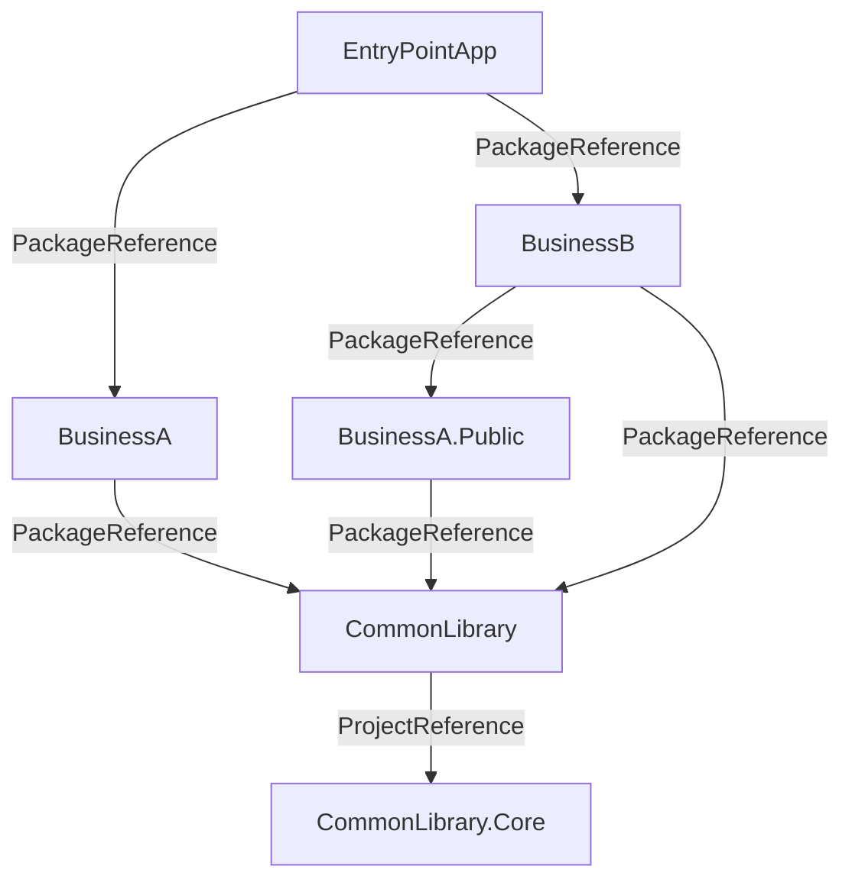
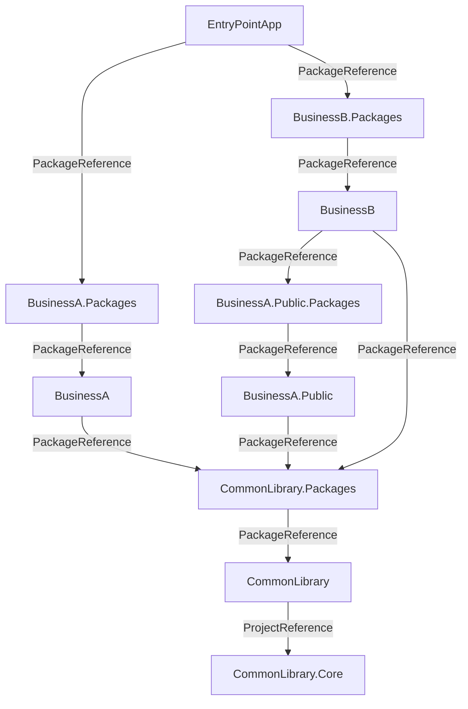
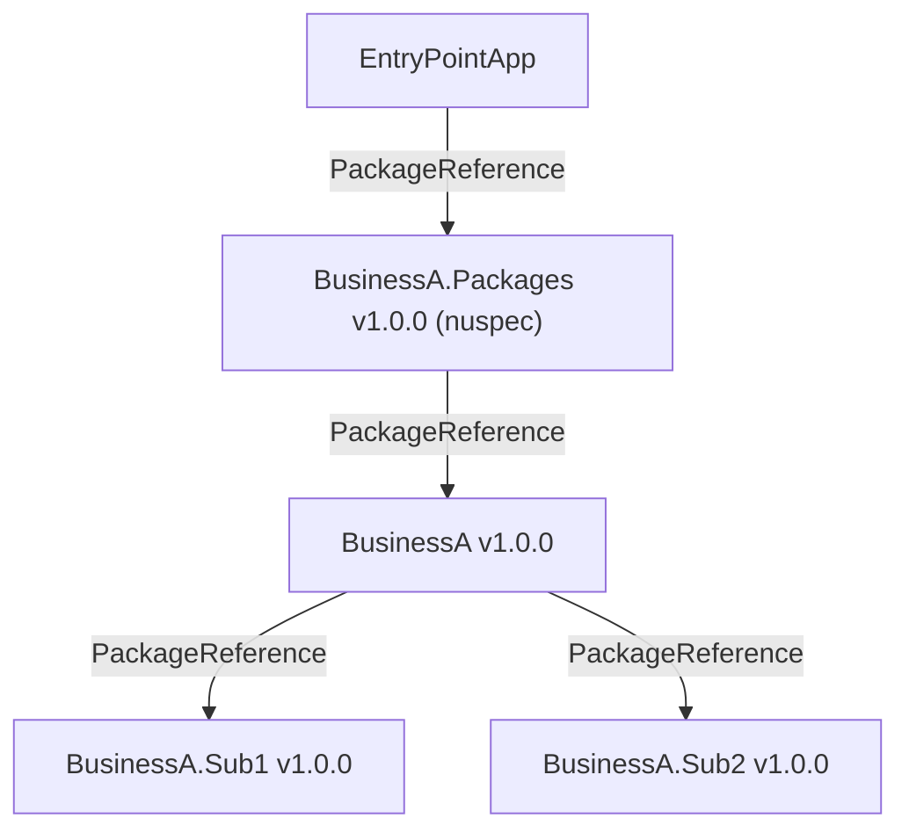
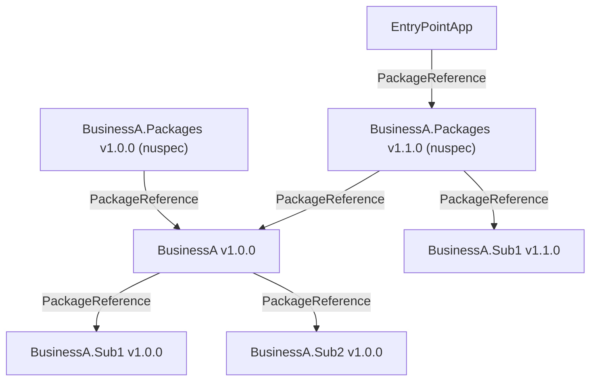
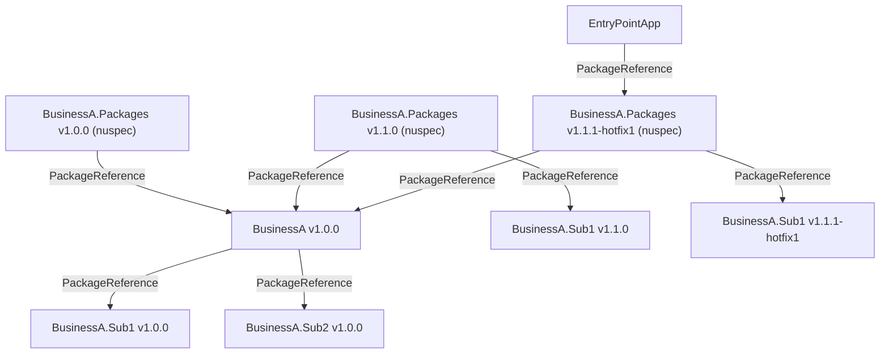

# Central Package Management 動作確認

## プロジェクトの依存関係

以下のような依存関係のプロジェクト



基本的にプロジェクト間の依存関係は `ProjectReference` ではなく `PackageReference` で管理する。同じ `Business` 内や `Common` 内は `ProjectReference` で管理する。

## パッケージ化

`Pack-Common.ps1`(CommonLibrary + CommonLibrary.Core) `Pack-BusinessA.ps1`(BusinessA), `Pack-BusinessA.Public.ps1`(BusinessA.Public), `Pack-BusinessB.ps1`(BusinessB) でそれぞれのプロジェクトをパッケージ化する。

## パッケージソース

`nuget.config` でローカルフォルダー(`./local`)をパッケージソースとして追加を行う。上記の `Pack-*.ps1` でパッケージ化したパッケージはこのフォルダーに保存される。

```xml:nuget.config
<?xml version="1.0" encoding="utf-8"?>
<configuration>
  <packageSources>
    <!--To inherit the global NuGet package sources remove the <clear/> line below -->
    <clear />
    <add key="nuget" value="https://api.nuget.org/v3/index.json" />
    <!-- 本番では Azure Artifacts や GitHub Packages を指定 -->
    <add key="local" value="./local" />
  </packageSources>
</configuration>
```

## `Directory.Build.props` と `Directory.Packages.props`

`BusinessA`, `BusinessB`, `Common` フォルダーにそれぞれ `Directory.Build.props` と `Directory.Packages.props` を配置する。
`Directory.Build.props` は、細かな差異はあるが概ね以下のような内容となる。

```xml:Directory.Build.props
<Project>
  <PropertyGroup>
    <TargetFramework>net8.0</TargetFramework>
    <ManagePackageVersionsCentrally>true</ManagePackageVersionsCentrally>
    <CentralPackageTransitivePinningEnabled>true</CentralPackageTransitivePinningEnabled>
    <UseArtifactsOutput>true</UseArtifactsOutput>
  </PropertyGroup>
  <ItemGroup>
    <PackageReference Include="CommonLibrary" />
  </ItemGroup>
</Project>
```

Central Package Management の有効化とフォルダー内のプロジェクトで共通的に参照するパッケージを指定する。
ただ、`PackageReference` は個別プロジェクトで指定しても良いと思われる。

`Directory.Packages.props` は、フォルダー配下で使用するパッケージのバージョンを指定する。

```xml:Directory.Packages.props
<Project>
  <ItemGroup>
    <PackageVersion Include="CommonLibrary" Version="1.0.0" />
    <PackageVersion Include="Microsoft.AspNetCore.Components.Web" Version="8.0.8" />
  </ItemGroup>
</Project>
```

## EntryPointApp プロジェクト

以下のようにアクセスするパッケージを指定する。

```xml:Directory.Build.props
<Project>
  <PropertyGroup>
    <TargetFramework>net8.0</TargetFramework>
    <ManagePackageVersionsCentrally>true</ManagePackageVersionsCentrally>
    <CentralPackageTransitivePinningEnabled>true</CentralPackageTransitivePinningEnabled>
  </PropertyGroup>
  <ItemGroup>
    <PackageReference Include="BusinessA" />
    <PackageReference Include="BusinessB" />
  </ItemGroup>

  <Import Project="CommonPackageReferences.props" />
</Project>
```

`CommonPackageReferences.props` は、共通的に参照するパッケージを指定する。このように切り出すことで共通的な項目のファイルの再利用が可能となる。不要な場合は1ファイルにまとめても良い。

```xml:CommonPackageReferences.props
<Project>
  <ItemGroup>
    <PackageReference Include="CommonLibrary" />
  </ItemGroup>
</Project>
```

パッケージのバージョン指定は `Directory.Packages.props` で行う。

```xml:Directory.Packages.props
<Project>
  <!-- 通常参照するライブラリ -->
  <ItemGroup>
    <PackageVersion Include="CommonLibrary" Version="1.0.0" />
    <PackageVersion Include="BusinessA" Version="1.0.0" />
    <PackageVersion Include="BusinessB" Version="1.0.0" />
  </ItemGroup>
  
  <!-- ホットフィックス -->
  <ItemGroup>
    <PackageVersion Include="BusinessA.Public" Version="1.0.0.1" />
  </ItemGroup>
</Project>
```

推移先の依存関係のライブラリで一時的な hotfix などが出た場合は明示的に PackageVersion を指定することで、そのバージョンを使用するようになる。

## hotfix の注意点

`1.0.0` の hotfix を `1.0.0-hotfix1` のようなバージョン番号でリリースを行うと上記の推移先のバージョンの固定機能でエラーが出る。

エラーの原因は `1.0.0-xxxxx` のような形式のバージョン番号は、`1.0.0` 正式リリース前のプレビューバージョンとして扱われるためダウングレードが行われていると認識されるためである。そのため `1.0.0.1` のようにするか `1.0.1-hotfix1` のようにバージョン番号を上げる必要がある。

## トップレベルのパッケージは dll を持たない references だけにする案

`BusinessA`, `BusinessB` などの DLL を持つパッケージではなく、依存関係だけを定義した `nuspec` ファイルを作成し、それをパッケージ化する案。nuspec ファイルで依存関係だけを定義したパッケージは実態をほぼ持たないためディスクスペースを圧迫しないため、バイナリの実態を持つパッケージとは別に管理することでディスクスペースを節約することが出来る。

`.Packages` サフィックスを付けたものが `nuspec` ファイルを持つパッケージとすると以下のような依存関係となる。



このようにすることで一部のパッケージだけバージョンアップした際には `.Packages` の依存関係の定義を更新してリリースすることでディスク容量は節約した状態で最新の一連のパッケージを利用することが出来るようになる。


### 例

例えば `BusinessA` が `BusinessA.Sub1`, `BusinessA.Sub2` に依存しているとする。バージョン番号は `BusinessA` が `1.0.0` で `BusinessA.Sub1` が `1.0.0` で `BusinessA.Sub2` が `1.0.0` であるとする。

そして `BusinessA` 業務としてリリースするべきパッケージの依存関係を定義した `nuspec` ファイルを元に `BusinessA.Packages` という名前のパッケージを作成する。このパッケージを参照することで `BusinessA` が `1.0.0` で `BusinessA.Sub1` が `1.0.0` で `BusinessA.Sub2` が `1.0.0` になる。



この状態で `BusinessA` の新機能のリリースで `BusinessA.Sub1` のバージョン `1.1.0` がリリースされたとする。`BusinessA.Sub1` はバイナリ互換があり `BusinessA` は `1.0.0` のままでも良い更新内容だとする。この場合、`BusinessA.Packages` で `BusinessA.Sub1` のバージョン `1.1.0` を参照するようにして `BusinessA.Packages` をリリースする。

新バージョンのアプリからは新たにリリースされた `BusinessA.Packages` の `1.1.0` を参照する。



この場合 NuGet のバージョン解決のルールにより `BusinessA.Packages v1.1.0` を参照すると以下の 3 つのパッケージがインストールされる。

- `BusinessA v1.0.0`
- `BusinessA.Sub1 v1.1.0`
- `BusinessA.Sub2 v1.0.0`

このようにすることでストレージコストを最小化しつつ最新のパッケージを利用することが実現できる。

hotfix のリリースも同様に `BusinessA.Packages` の依存関係を更新してリリースすることで最新のパッケージを利用することが出来る。例えば `BusinessA.Packages v1.1.0` のリリース後に `BusinessA.Sub1` に hotfix がリリースされた場合は `BusinessA.Packages` の依存関係を更新してリリースする。hotfix バージョンはセマンティックバージョニングに従い `1.1.1-hotfix1` のようなバージョン番号を付ける。

`v1.1.1-hotfix1` のリリース後の状態は以下のようになる。


